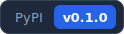

 > [!WARNING]
 > 这是自动翻译。欢迎社区修正!

---

    <picture>
      <source media="(prefers-color-scheme: light)" srcset=".github/assets/logo-dark.svg">
      <source media="(prefers-color-scheme: dark)" srcset=".github/assets/logo-light.svg">
      
    </picture>

<a href="https://pypi.org/project/EvoScientist/"><picture>
  <source media="(prefers-color-scheme: light)" srcset=".github/assets/badge-pypi-light.svg">
  <source media="(prefers-color-scheme: dark)" srcset=".github/assets/badge-pypi-dark.svg">
  
</picture></a><a href="https://evoscientist.ai/"><picture>
  <source media="(prefers-color-scheme: light)" srcset=".github/assets/badge-website-light.svg">
  <source media="(prefers-color-scheme: dark)" srcset=".github/assets/badge-website-dark.svg">
  
</picture></a><a href="https://github.com/langchain-ai/deepagents"><picture>
  <source media="(prefers-color-scheme: light)" srcset=".github/assets/badge-framework-light.svg">
  <source media="(prefers-color-scheme: dark)" srcset=".github/assets/badge-framework-dark.svg">
  
</picture></a><a href="https://github.com/EvoScientist/EvoScientist/blob/main/LICENSE"><picture>
  <source media="(prefers-color-scheme: light)" srcset=".github/assets/badge-license-light.svg">
  <source media="(prefers-color-scheme: dark)" srcset=".github/assets/badge-license-dark.svg">
  
</picture></a>

---

**[English](./README.md) | 简体中文**

**TODO**